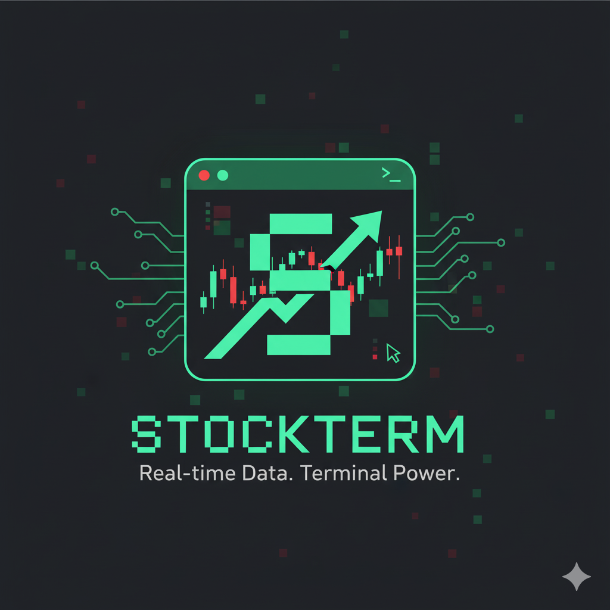

<a name="readme-top"></a>

<div align="center">
  <h1>StockTerm</h1>
  <p>A modern terminal-based stock viewer with real-time data</p>

  <p>
    <a href="https://github.com/AyhamJo7/StockTerm/releases/latest">
      
    </a>
    <a href="https://github.com/AyhamJo7/StockTerm/actions">
      
    </a>
    <a href="https://goreportcard.com/report/github.com/AyhamJo7/StockTerm">
      
    </a>
    <a href="LICENSE">
      
    </a>
    <a href="https://golang.org">
      
    </a>
  </p>

  <p>
    <a href="#features">Features</a> •
    <a href="#installation">Installation</a> •
    <a href="#usage">Usage</a> •
    <a href="#configuration">Configuration</a> •
    <a href="#contributing">Contributing</a> •
    <a href="#license">License</a>
  </p>

  
</div>

## Features

StockTerm is a powerful terminal-based stock viewer that provides real-time stock data directly in your terminal. It's designed to be fast, efficient, and easy to use.

- **Real-time Stock Data**: Get up-to-date stock prices and market data
- **Customizable Watchlist**: Maintain a personal list of stocks you're interested in
- **Interactive UI**: Navigate and edit your watchlist with an intuitive terminal interface
- **Color-coded Display**: Easily identify price movements with color-coded indicators
- **Multiple Commands**: View individual stocks, your entire watchlist, or manage your watchlist
- **Fast and Lightweight**: Minimal resource usage, perfect for keeping open in a terminal
- **Cross-platform**: Works on Windows, macOS, and Linux

## Installation

### From Binary Releases

Download the latest binary for your platform from the [releases page](https://github.com/AyhamJo7/StockTerm/releases).

### Using Go Install

If you have Go installed, you can install StockTerm directly:

```bash
go install github.com/AyhamJo7/StockTerm/cmd/stockterm@latest
```

### Building from Source

1. Clone the repository:
   ```bash
   git clone https://github.com/AyhamJo7/StockTerm.git
   cd StockTerm
   ```

2. Build the application:
   ```bash
   make build
   ```

3. The binary will be available in the `build` directory.

## Usage

StockTerm provides several commands to interact with stock data:

### View Stock Prices

To view the current price of a specific stock:

```bash
stockterm get MSFT
```

You can also view multiple stocks at once:

```bash
stockterm get AAPL,GOOGL,MSFT
```

### Manage Your Watchlist

Add stocks to your watchlist:

```bash
stockterm add TSLA
```

Add multiple stocks at once:

```bash
stockterm add AAPL,META,TSLA
```

Remove stocks from your watchlist:

```bash
stockterm remove TSLA
```

View your entire watchlist:

```bash
stockterm get-all
```

Edit your watchlist interactively:

```bash
stockterm list
```

### Help and Version Information

Display help information:

```bash
stockterm help
```

Display version information:

```bash
stockterm version
```

## Configuration

StockTerm stores its configuration and watchlist in the following location:

- **Linux/macOS**: `~/.stockterm/`
- **Windows**: `%USERPROFILE%\.stockterm\`

The watchlist is stored in a simple text file at `~/.stockterm/watchlist.txt`.

## Contributing

Contributions are welcome! Please feel free to submit a Pull Request.

1. Fork the repository
2. Create your feature branch (`git checkout -b feature/amazing-feature`)
3. Commit your changes (`git commit -m 'Add some amazing feature'`)
4. Push to the branch (`git push origin feature/amazing-feature`)
5. Open a Pull Request

Please read [CONTRIBUTING.md](CONTRIBUTING.md) for detailed guidelines.

## License

Distributed under the MIT License. See [LICENSE](LICENSE) for more information.

## Acknowledgements

- [Yahoo Finance API](https://finance.yahoo.com/) for providing stock data
- [Bubble Tea](https://github.com/charmbracelet/bubbletea) for the terminal UI framework
- [go-pretty](https://github.com/jedib0t/go-pretty) for the table formatting

<p align="right">(<a href="#readme-top">back to top</a>)</p>
